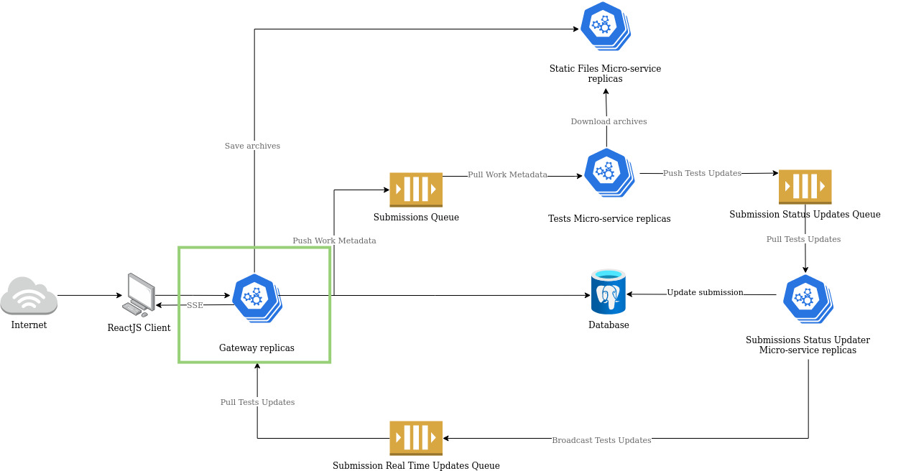

# Gateway

Welcome to the gateway repository. This service is responsible for the following tasks:

- Authentication
- Authorization
- Serve the REST API
- Send SSE updates to the web client
- Proxy requests to the static files micro-service
- Publish messages to the RabbitMQ submissions queue

Bellow is a diagram of the overall architecture of the system with the gateway / main api highlighted in green.

## Documentation

Please, refer to the following documents for more information about the gateway service:

| Document                                                  | Description                                                                                         |
| --------------------------------------------------------- | --------------------------------------------------------------------------------------------------- |
| [Contributing](./docs/contributing.md)                    | Contributing guidelines.                                                                            |
| [Environment](./docs/environment.md)                      | A description of the environment variables used by the gateway service.                       |
| [Bruno Collection](./docs/bruno)                          | A collection of REST API requests to be used with [Bruno](https://github.com/usebruno/bruno).       |
| [Insomnia Collection](./docs/insomnia)                    | A collection of REST API requests to be used with [Insomnia](https://insomnia.rest/).               |
| [OpenAPI Specification](./docs/openapi/spec.openapi.yaml) | A description of the REST API using the [OpenAPI Specification](https://swagger.io/specification/). |
